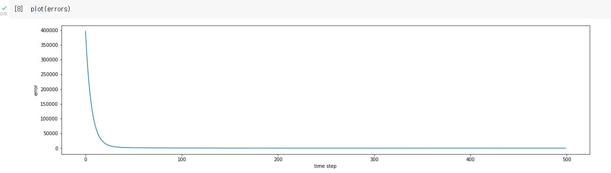

# AI Math
## 6. 확률론 기초
* 확률론은 기계학습 분야의 바탕이 되는 기본적인 학문입니다.
* 딥러닝에서도 손실함수 (loss function)들의 작동원리가 통계적으로 해석됩니다.
    * $L_{2}$-노름은 회귀분석에서 예측 오차의 분산을 최소화 하는 방향으로 학습합니다.
    * 교차엔트로피(cross-entropy)는 분류문제에서 모델 예측의 불확실성을 최소화하는 방향으로 학습됩니다.

* 이산확률변수
    * 이산형 확률 변수는 각각의 개별적인 확률들을 모두 더하는 형테로 모델링 됩니다.
    $$
    \mathbb{P}(X \in A)=\sum_{\mathbf{x} \in A} P(X=\mathbf{x})
    $$
* 연속확률변수
    * 데이터 공간에서 확률변수의 밀도 (density)를 누적하는 것으로 모델링 됩니다.
    $$
    \mathbb{P}(X \in A)=\int_{A} P(\mathbf{x}) \mathrm{d} \mathbf{x}
    $$

* 통계량
    * 기대값: 데이터를 대표하는 통계량입니다.
    $$
    \mathbb{E}_{\mathbf{x} \sim P(\mathbf{x})}[f(\mathbf{x})]=\int_{X} f(\mathbf{x}) P(\mathbf{x}) \mathrm{d} \mathbf{x}, \quad \mathbb{E}_{\mathbf{x} \sim P(\mathbf{x})}[f(\mathbf{x})]=\sum_{\mathbf{x} \in \mathcal{X}} f(\mathbf{x}) P(\mathbf{x})
    $$

    * 분산:
    $$
    \mathbb{V}(\mathbf{x})=\mathbb{E}_{\mathbf{x} \sim P(\mathbf{x})}\left[(\mathbf{x}-\mathbb{E}[\mathbf{x}])^{2}\right]
    $$
    
    * 외도: 
    $$
    \text { Skewness }(\mathbf{x})=\mathbb{E}\left[\left(\frac{\mathbf{x}-\mathbb{B}[\mathbf{x}]}{\sqrt{V(\mathbf{x})}}\right)^{3}\right]
    $$

    * 공분산: 
    $$
    \operatorname{Cov}\left(\mathbf{x}_{1}, \mathbf{x}_{2}\right)=\mathbb{E}_{\mathbf{x}_{1}, \mathbf{x}_{2} \sim P\left(\mathbf{x}_{1}, \mathbf{x}_{2}\right)}\left[\left(\mathbf{x}_{1}-\mathbb{E}\left[\mathbf{x}_{1}\right]\right)\left(\mathbf{x}_{2}-\mathbb{E}\left[\mathbf{x}_{2}\right]\right)\right]
    $$

* 조건부 확률분포
    * 조건부확률 분포는 확률 변수는 확률 변수 x를 조건으로 하는 확률 변수 y의 분포입니다. 
    $$
    P(y \mid \mathbf{x})
    $$

    * 분류문제에서 소프트맥스 함수를 조건부 확률 변수로 해석할 수 있는데 데이터로부터 추출된 특징 (feature)들에 따른 조건부 확률이라고 볼 수 있습니다.  즉 분류문제에서 데이터에서 추출된 패턴을 기반으로 확률을 해석합니다.

    * 회귀문제에서는 조건부 확률이 아니라 조건부 기대값을 통해 추정합니다. 이 때 조건부기대값을 추정합니다. 이 때 조건부기대값은 목적식 $\mathbb{E}\|y \mid-f(\mathbf{x})\|_{2}$을 최소화하는 함수 $f(x)$와 일치합니다.
    $$
    \mathbb{E}_{y \sim P(y \mid \mathbf{x})}[y \mid \mathbf{x}]=\int_{y} y P(y \mid \mathbf{x}) \mathrm{d} y
    $$

* 몬테카를로 샘플링
    * 기계학습의 많은 문제들은 확률분포를 모르는데 기대값을 계산하기 위해서는 몬테카를로 (Monte Carlo) 샘플링 방법을 사용해야 합니다.
    * 이산형 연속형 상관없이 성립하며 독립추출이 보장된다면 대수의 법칙 (law of large number)에 의해 수렴성을 보장합니다.

## 통계학 기초
* 정의
    * 모집단: 통계분석 방법을 적용할 관심 대상입니다. 
    * 표본집단: 모집단에서 추출된 표본 (sample)들의 집단입니다.
    * 모수란: 모수는 모집단을 대표하는 편균, 분산 비율과 같은 특성을 표현하는 수를의미합니다.
    * 통계량: 모수와 다른점은 표본에서 얻을 수 있는 수치입니다.

* 통계적 모델링을 통하여 데이터와 적절한 가정을 사용하여 우리가 얻고자 하는 확률분포 (inference)를 추정합니다. 그러나 데이터가 유한하므로 최대한 근사적으로 확률 분포를 통하여 추정하려고 합니다.
    * 모수적 (parametric) 방법론: 데이터가 특정 확률분포를 따른다고 가정하고 모수를 추정하는 방법입니다.
        * 확률 분포 가정
            * 베르누이 분포: 데이터가 0/1 2개의 값만 가지는 경우
            * 카테고리 분포: 데이터가 n개의 이산적인 값을 가지는 경우
            * 베타분포: 데이터가 0~1 사이의 값을 가지는 경우
            * 감마분포, 로그정규분포: 데이터가 0 이상의 값을 가지는 경우
            * 정규분포, 라플라스분포: 데이터가 실수 전체에서 값을 가지는 경우
        * 데이터의 특성을 알고 가정하는 것이 중요합니다.

    * 비모수적 (nonparametric) 방법론: 데이터가 특정 확률분포를 따르는지 상관없이 데이터에 따라 모델 구조와 모수를 유연하게 바꾸는 방법론입니다.

* 모수 추정
    * 데이터의 확률분포를 가정하여 모수를 추정
    $$
    \bar{X}=\frac{1}{N} \sum_{i=1}^{N} X_{i} \quad S^{2}=\frac{1}{N-1} \sum_{i=1}^{N}\left(X_{i}-\bar{X}\right)^{2}
    $$
    $$
    \mathbb{E}[\bar{X}]=\mu \quad \mathbb{E}\left[S^{2}\right]=\sigma^{2}
    $$
    * 표본 분산을 구할 때 N-1나누는 이유는 불편(unbiased) 추정량을 구하기 해서입니다.
    * 통계량의 확률분포를 표집분포(sampling distribution)이라고 부릅니다.
    * 표본평균의 표집분포는 N이 커질수록 정규분포 $\mathcal{N}\left(\mu, \sigma^{2} / N\right)$를 따릅니다.

* 최대가능도 추정법
    * 최대가능도 추정법 (Maximum Likelihood Estimation,MLE)은 이론적으로 가능성이 가장 높은 모수를 추정하는 방법입니다.
    $$
    \hat{\theta}_{\mathrm{MLE}}=\underset{\theta}{\operatorname{argmax}} L(\theta ; \mathbf{x})=\underset{\theta}{\operatorname{argmax}} P(\mathbf{x} \mid \theta)
    $$

    * 로그가능도
        * 데이터가 독립적으로 추출되었을 경우에는 로그가능도로 최적화 할 수 있습니다.
        $$
        L(\theta ; \mathbf{X})=\prod_{i=1}^{n} P\left(\mathbf{x}_{i} \mid \theta\right) \quad \Rightarrow \quad \log L(\theta ; \mathbf{X})=\sum_{i=1}^{n} \log P\left(\mathbf{x}_{i} \mid \theta\right)
        $$  

        * 로그가능도를 사용하면 덧셈으로 연산이 바뀌기 때문에 컴퓨터 연산에 효율적입니다.
        * 경사하강법을 이용하는 경우 음의 로그가능도 (negative log-likelihood)를 최적화합니다.

* 확률분포의 거리
    * 데이터 공간에서 $P(\mathbf{x})$, $Q(\mathbf{x})$의 두 확률 분포의 거리를 이용하여 기계학습에서 손실함수로 사용합니다.
    * 총변동 거리 (Total Variation Distance, TV)
    * 바슈타인 거리 (Wasserstein Distance)

    * 쿨백-라이블러 발산 (Kullback-Leibler Divergence, KL)
    $$
    \mathbb{K} \mathbb{L}(P \| Q)=\sum_{\mathbf{x} \in X}^{\text {이산확률변수 }} P(\mathbf{x}) \log \left(\frac{P(\mathbf{x})}{Q(\mathbf{x})}\right) \quad \mathbb{K L}(P \| Q)=\int_{X}^{\text {연속확률변수 }} P(\mathbf{x}) \log \left(\frac{P(\mathbf{x})}{Q(\mathbf{x})}\right) \mathrm{d} \mathbf{x}
    $$
    $$
    \mathbb{K} \mathbb{L}(P \| Q)=-\mathbb{E}_{\mathbf{x} \sim P(\mathbf{x})}[\log Q(\mathbf{x})]+\mathbb{E}_{\mathbf{x} \sim P(\mathbf{x})[\log P(\mathbf{x})]}
    $$
    * 분류문제로 보면 쿨백-라이블러 발산을 최소화하는 것과 최대가능도 추정법은 같은 의미를 가집니다.

## 베이즈 통계학 기초
* 베이즈 정리란?
    * 사전확률과 사후확률 사이의 관계를 나타내며 사전확률로 사후확률을 구할 수 있습니다.
    $$
    P(\theta \mid \mathcal{D})=P(\theta) \frac{P(\mathcal{D} \mid \theta)}{P(\mathcal{D})}
    $$
    * $P(\theta)$: 사전확률 (prior)
    * $P(\theta \mid \mathcal{D})$: 사후확률 (posterior)
* 조건부 확률 $P(A \mid B)$은 사건 $B$가 일어난 상황에서 사건$A$가 발생할 확률을 의미합니다.
$$
\begin{gathered}
P(A \cap B)=P(B) P(A \mid B) \\
P(B \mid A)=\frac{P(A \cap B)}{P(A)}=P(B) \frac{P(A \mid B)}{P(A)}
\end{gathered}
$$

* 베이즈 정리를 통한 정보의 갱신
    * 베이즈 정리를 통해 이전 사후 확률을 새로운 사전확률로 사용하여 업데이트 된 사후확률을 계산 할 수 있습니다.

* 인과관계
    * 데이터 분포 변화에 강건한 예측모형을 만들기 때 인과관계가 사용됩니다.
    * 조건부 확률은 통계적 해석에 아주 좋은 방법이지만 인과 관계 (casuality)가 연관되면 함부로 사용하면 안됩니다.
    * 인과관계에서는 중첩요인 (confouding factor)를 제거하고 인과 관계를 알아야 합니다.


# 과제
## 선택과제 1
### 1) Gradient Descent (1)
* 경사하강법을 구현하기 위한 과제였다. 처음에는 sympy를 이용하여 gradient를 계산하였다. 기본적인 수도코드를 참고하여 gradient를 업데이트 해주었다. 아래는 추가한 코드 부분이다.
```
def func_gradient(fun, val):
    ## TODO
    _, fun = func(val)
    diff = sym.diff(fun, x)
    return diff.subs(x, val), diff

def gradient_descent(fun, init_point, lr_rate=1e-2, epsilon=1e-5):
    cnt = 0
    val = init_point
    ## Todo
    grad, _ = func_gradient(fun, val)   # gradient

    while np.abs(grad) > epsilon:   # 종료조건
        val = val - lr_rate * grad  # 업데이트
        grad, _ = func_gradient(fun, val)
        cnt = cnt + 1
    
    print("함수: {}\n연산횟수: {}\n최소점: ({}, {})".format(fun(val)[1], cnt, val, fun(val)[0]))

gradient_descent(fun = func, init_point = 3)
# 함수: Poly(x**2 + 2*x + 3, x, domain='ZZ')
# 연산횟수: 673
# 최소점: (-0.999995020234038, 2.00000000002480)
```
* 위와 같이 673번만에 종료조건을 만족아혀 목적하였건 최소점 (-1,2)에 근사한 값을 얻을 수 있었다.

### 2) Gradient Descent (2)
* 위의 sympy와 달리 직점 아주 작은 수 h를 이용하여 미분값을 근사하여 구현하는 문제였다. 구현한 미분 함수는 다음과 같다.
```
def difference_quotient(f, x, h=1e-9):
    ## Todo
    f_x = f(x)
    f_x_h = f(x+h)
    return (f_x_h - f_x)/h
```
* 최종적으로는 아래와 같이 비슷한 672번의 횟수로 목적했던 결과의 근사치를 얻을 수 있었다.
```
gradient_descent(func, init_point=3)
연산횟수: 672
최소점: (-0.999994846459742, 2.00000000002656)
```
* 

### 3) Linear Regression
#### 3-1. Basic function
* 조금 난이도가 올라간 느낌이었는데 강의자료를 참고하여 각 성분에 대해 미분하여 결과를 구현하였다.
```
train_x = (np.random.rand(1000) - 0.5) * 10
train_y = np.zeros_like(train_x)

def func(val):
    fun = sym.poly(7*x + 2)
    return fun.subs(x, val)

for i in range(1000):
    train_y[i] = func(train_x[i])

# initialize
w, b = 0.0, 0.0

lr_rate = 1e-2
n_data = len(train_x)
errors = []

for i in range(100):
    ## Todo
    # 예측값 y
    _y = w * train_x + b

    # gradient
    gradient_w = -np.mean(train_x * (train_y - _y))
    gradient_b = -np.mean(train_y - _y)

    # w, b update with gradient and learning rate
    w = w - lr_rate * gradient_w
    b = b - lr_rate * gradient_b

    # L2 norm과 np_sum 함수 활용해서 error 정의
    error = np.sum(np.square(train_y-_y))
    # Error graph 출력하기 위한 부분
    errors.append(error)

print("w : {} / b : {} / error : {}".format(w, b, error))
```
* 처음에 주어진대로 100번을 돌렸을 떄에는 w는 어느정도 근사치를 보였지만 b는 근사치를 보여주지 못하였다. 에러를 확인하니 역시 큰값이었다.
```
w : 6.999290693363847 / b : 1.2685573119751654 / error : 545.8787852859643
```
* 그래서 다음에는 학습 횟수를 500번까지 늘려서 결과를 보았고 목적했던 결과와 비슷한 출력을 얻을 수 있었다.
```
w : 7.000071093132297 / b : 1.9870990999304934 / error : 0.1697809837093649
```
* 에러를 플롯해보니 다음과 같이 이쁘게 떨어지는 것을 볼 수 있었다.


#### 3.2. More complicated function
* 그리고 좀더 확장해서 여러개의 계수를 구하는 문제를 수행하였다.
```
train_x = np.array([[1,1,1], [1,1,2], [1,2,2], [2,2,3], [2,3,3], [1,2,3]])
train_y = np.dot(train_x, np.array([1,3,5])) + 7

# random initialize
beta_gd = [9.4, 10.6, -3.7, -1.2]
# for constant element
expand_x = np.array([np.append(x, [1]) for x in train_x])

for t in range(5000):
    ## Todo
    _y = expand_x @ beta_gd 
    grad = -np.transpose(expand_x) @ (train_y - _y)
    beta_gd = beta_gd - lr_rate * grad

print("After gradient descent, beta_gd : {}".format(beta_gd))
```
* 목적했던 근사치에 도달하는 것을 볼 수 있었다.
```
After gradient descent, beta_gd : [1.         3.         5.         6.99999999]
```

### 4. Stochastic Gradient Descent
* 마지막 문제는 3-1을 변경하여 mini-batch에 대하여 학습하도록 하는 것이었다.
```
for e in range(1):
    index_batch = range(1000)
    for i in range(100):
        ## Todo
        index_mini_batch = np.random.choice(index_batch, size=10, replace=False, )
        # 예측값 y
        _y = w * train_x[index_mini_batch] + b

        # gradient
        gradient_w = -np.mean(train_x[index_mini_batch] * (train_y[index_mini_batch] - _y))
        gradient_b = -np.mean(train_y[index_mini_batch] - _y)

        # w, b update with gradient and learning rate
        w = w - lr_rate * gradient_w
        b = b - lr_rate * gradient_b

        # L2 norm과 np_sum 함수 활용해서 error 정의
        error = np.sum(np.square(train_y[index_mini_batch]-_y))
        # Error graph 출력하기 위한 부분
        errors.append(error)

print("w : {} / b : {} / error : {}".format(w, b, error))
```
* 랜덤하게 인덱스를 뽑아서 미니뱃치를 만들었고 비복원 옵션을 주어서 한 epoch동안 데이터들이 한번씩 학습되도록 하였다. for문을 2개로 만들어 epoch를 기준으로 학습 할 수 있도록 구현하였다.
* 1 epoch로 같은 횟수를 학습하였을 때 full-batch보다 작은 에러를 보였다.
```
w : 7.005582389482701 / b : 1.362923194063601 / error : 4.1357411581200605
```
* 5 epoch를 돌리자 목적했던 근사치를 볼 수 있었다.
```
w : 7.000387467552241 / b : 1.9883237237543712 / error : 0.0013147378135291122
```
* 에러 그래프를 보면 full-batch와 달리 에러 값이 증가하는 경우도 있었지만 1회에 1/10의 데이터만 사용하고도 효율적으로 학습한 결과를 볼 수 있었다.


# [피어세션](https://hackmd.io/@ai17/BkCPyMK1Y)

# 후기
확률, 통계에 대한 기본을 복습하고 선택과제를 통하여 경사하강법에 대하여 다시 공부하였다. 이미 잘 구현되어 함수로만 사용했었던 경사하강법을 직접 구현하니 좀더 정확히 이해를 할 수 있었다.