# Deep Learning Basic
## 4.Convolution
* 2D image convolution
    $$
    (I * K)(i, j)=\sum_{m} \sum_{n} I(m, n) K(i-m, j-n)=\sum_{m} \sum_{n} I(i-m, i-n) K(m, n)
    $$

* RGB image Convolution
    * 이미지에서 2D conv는 커널의 특성에따른 각 지역적인 특징점을 추출하게 된다.
    * 여러개의 필터를 사용하면 여러층의 특징맵이 생성합니다.
    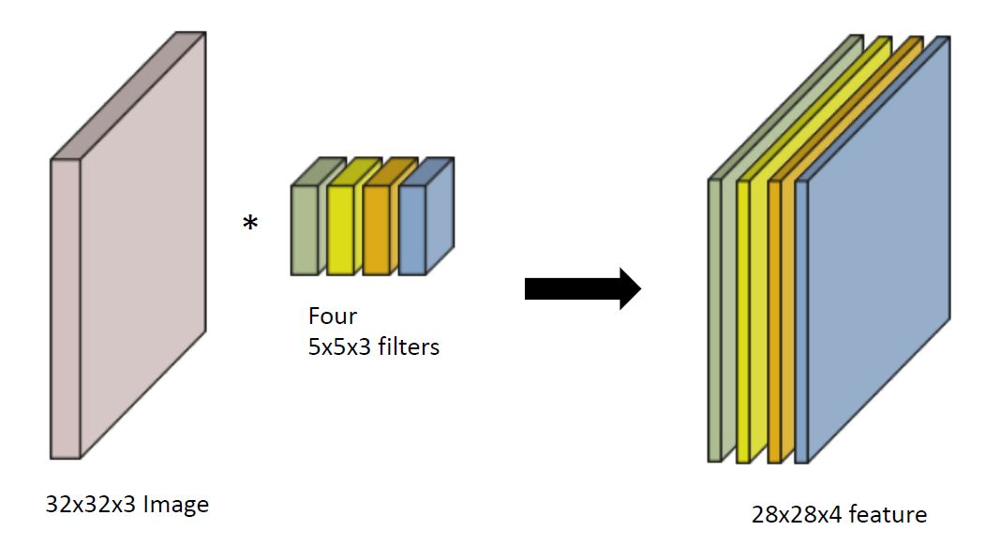

* Stack of Convolution
    * 이러한 convolution 연산을 Convolutional Neural Network (CNN)에서는 여러층 쌓아서 이용하게 됩니다.
    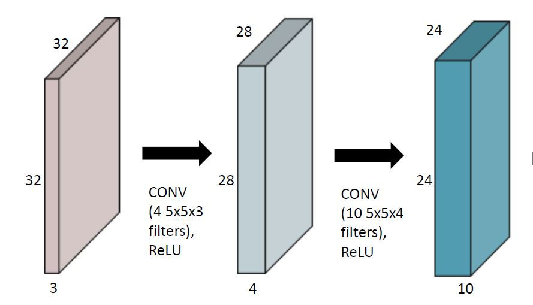

* Convolutional Neural Network (CNN)
    * 기본적으로 convoltion layer, pooling layer, fully connected layer로 구성됩니다.
    * convoltion layer: 특징점을 추출합니다.1
    * pooling layer: 특징맵의 사이즈를 줄입니다.
    * fully connected layer: 추출된 특징을 이용하여 분류같은 decision making을 합니다.
    * stride: 커널을 얼마나 떨어트려서 적용하는가를 결정하는 파라미터입니다.
    * padding: 커널에 의해 적용하지 못하는 외각 부분때문에 사이즈가 작아지는 것을 막아주기 위하여 외각 부분을 확장해주는 걸 말합니다.

* number of parameter in convolution
    * input: $w$ x $h$ x $c_{1}$, out: $w$ x $h$ x $c_{2}$, kernel: $n$ x $n$ x $c_{1}$이면
    * number of parameter: $n$ x $n$ x $c_{1}$ x $c_{2}$

* 1x1 convolution
    * Dimension reduction
    * depth를 늘리면서 파라미터의 수를 줄이기 위해 사용됩니다.

## 5.Modern CNN
* ImageNet Large-Scale Visual Recognition Challenge (ILSVRC)
    * Classification, Detection, Localization, Segmentation
    * 1000 different category
    * over 1 million images
    * training set: 456567 images

* AlexNet
    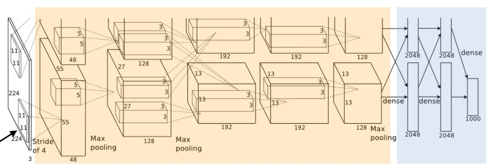
    * key ideas
        * Rectified Linear Unit (ReLU) activation 
            * $R(x)=max(0,z)$
            * 비선형 특성
            * 경사하강법 학습이 쉬워짐
            * 좋은 일반화
            * gradient vanishing을 어느정도 극복
        * GPI implementation (2 GPUs)
        * Local response normalization, Overlapping pooling
        * Data augmentation
        * Dropout

* VGGNet
    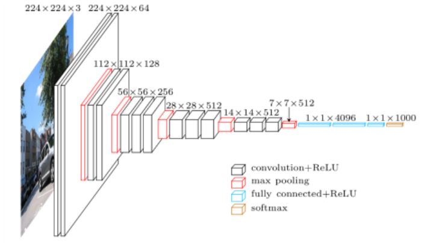
    * 3x3 conv 들을 활용
        * 커널의 크기가 커지면 이미지에서 고려하는 영역의 크기가 커집니다.
        * 3x3 conv을 여러번 반복해서 사용하면 점점 더 큰 영역의 크기를 고려할 수 있습니다.
        * 파라미터의 수를 보면 3x3 conv 두번 사용하는 것이 5x5 conv보다 줄일 수 있습니다.
        * 활성화 함수를 중간에 넣어서 비선형성도 추가될 수 있습니다.
    * fully connected layer를 위해 1x1 conv를 활용
    * Dropout (p=0.5)
    * VGG19, VGG16

* GoogLeNet
    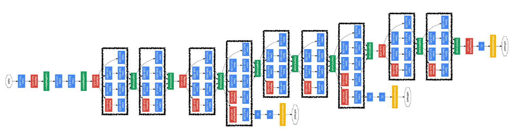
    * Inception blocks
        * 여러 사이즈의 conv와 사용하여 여러개의 receptive field를 고려할 수 있습니다.
        * 또한 1x1 conv로 파라미터의 수를 줄일 수 있었습니다.
            * 채널 방향으로 dimension reduction

* ResNet
    * 깊은 네트워크일수록 학습이 어려워집니다. ResNet은 이러한 부분을 skip connection을 이용하여 극복합니다.
    * Identity map (skip connection)
        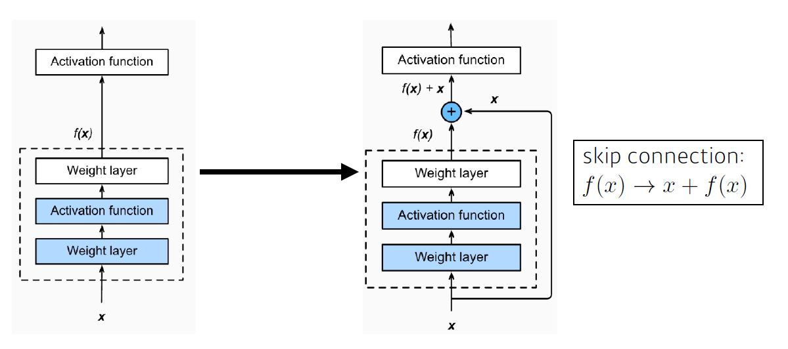
        * 전과 후의 layer에서 residual 즉 차이만을 학습하게 합니다.
        * conv layer 뒤에 batch norm이 적용됩니다.
    * Bottleneck architecture
        * 1x1 conv layer를 이용하여 channel을 조정할 수 있습니다.

* DenseNet
    * Dense block
        * shortcut에서 나오는 정보를 더하는 것이 아니라 concat하여 채널방향으로 늘려서 사용합니다. (더하게 되면 정보가 섞이게 되므로)
    * Transition block
        * dense block으로 늘어난 채널을 줄이는 block입니다.
        * batch norm -> 1x1 conv -> 2x2 AvgPooling

## 6.Computer Vision Application
* Detection
    * classification이 이미지가 어떤 이미지인지 분류한다면 detection은 이미지의 분류 뿐만 아니라 위치를 함께 찾는 task입니다. 
    * 위치는 주로 사각형 박스로 표현해 한점의 위치와 가로세로 길이로 표현하거나 대각선의 두 점으로 박스를 표현합니다.

    * 대표적인 detection 방법들
        * R-CNN
            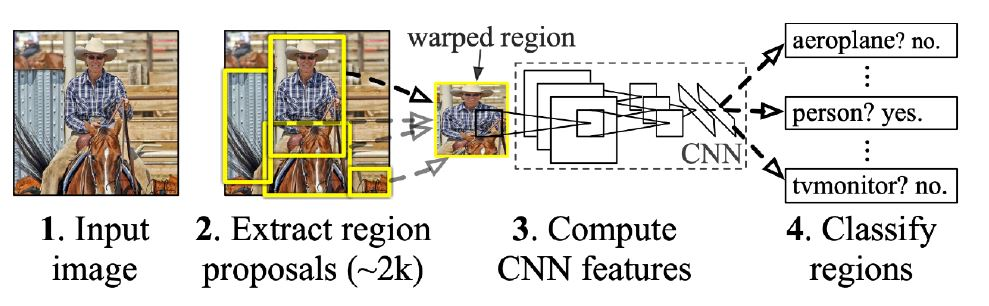
            * R_CNN은 다은과 같은 과정을 거쳐 물체의 위치와 class를 추정합니다.
                1. 입력 이미지에서 물체가 있을 법한 이미지의 영역을 2000개정도 제안합니다. 
                2. 제안된 이미지를 CNN을 통해 틍징을 추출합니다.
                3. SVM과 같은 알고리즘을 통해 제안된 영역의 class를 분류합니다.

        * SPPNet
            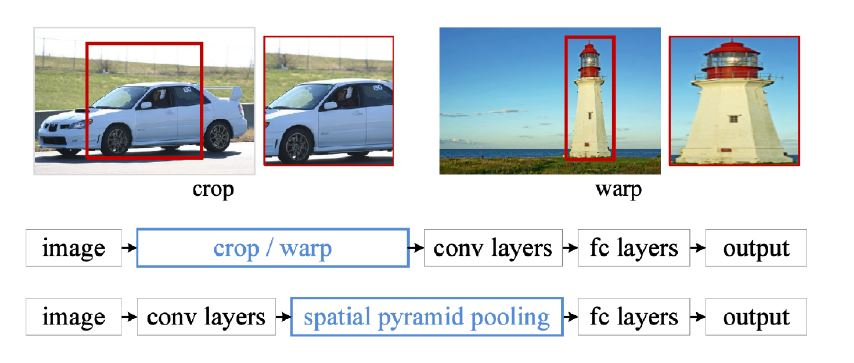
            * RCNN에서 CNN을 제안된 영역을 2000번 CNN model을 돌려야 했는데 SPPNet은 처음에 한번에 전체 feature를 뽑고 제안된 영역의 feature를 잘라 속도를 높였습니다.

        * Fast RCNN
            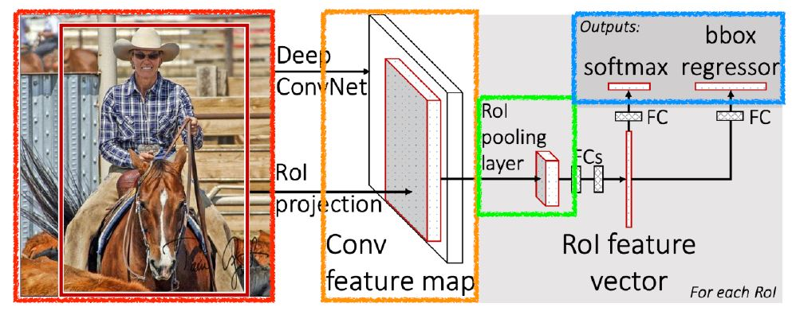
            * SPPNet과 같이 한번에 feature를 추출합니다.
            * 그리고 RoI pooling을 이용하여 feature map 상에서 특정 영역의 feature 벡터를 가져옵니다.

        * Faster RCNN
            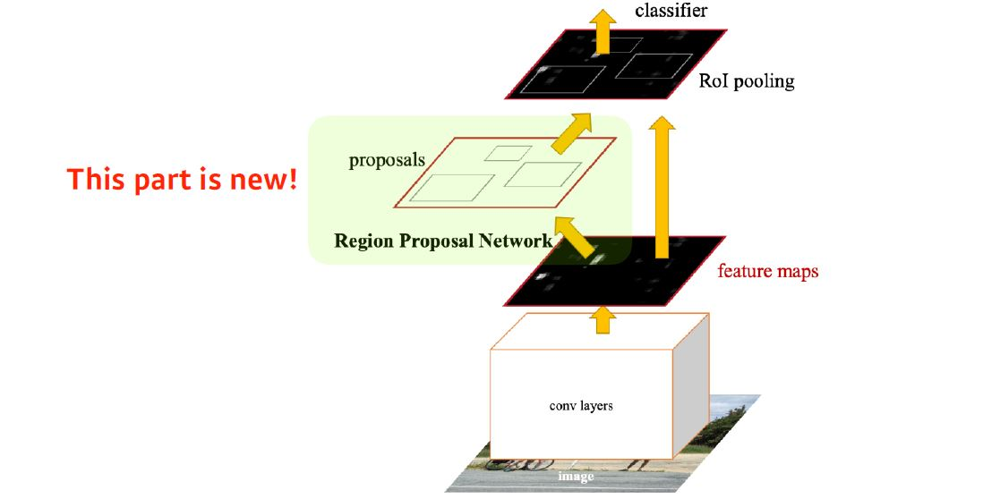
            * fast RCNN에서 영역을 제안하는 부분마저 학습을 하는 Region proposal network를 제안하여 전체를 딥러닝 모델을 사용해서 bottleneck 현상을 제거하였습니다. 이로써 속도가 더 빨라졌습니다.
            * Region proposal network
                * 특정한 크기의 anchor boxes들을 이용하여 slide되면서 한위치에서 여러 모양의 bounding box좌표와 특정 물체가 있을 확률을 한번에 계산합니다.
                * 한 위치에서의 출력은 9x(4+2)의 벡터로 출력됩니다.
                    1. 다른 영역의 anchor box: 9개
                    2. bounding box의 위치: 4
                    3. box classification 경과 (물체인지 아닌지 지표 수) 

        * YOLO
            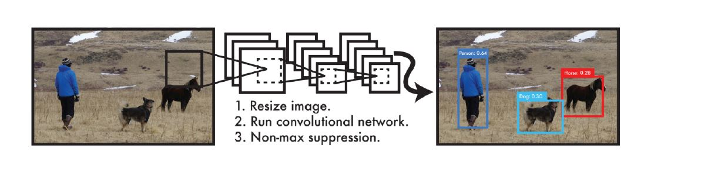
            * real-time detection이 될 정도로 빠른 object detection 알고리즘입니다.
            * 여러개의 bounding box의 위치와 class를 동시에 추정하여 속도가 매우 빠릅니다.

* Semantic Segmentation
    * detection이 물체의 사각형의 bouding box로 위치를 표현한다면 segmentation은 pixel 하나하나가 어떤 class에 있을 지 추정하여 물체의 외각선까지 분류하는 문제입니다.
    * Fully Convolutional Network
        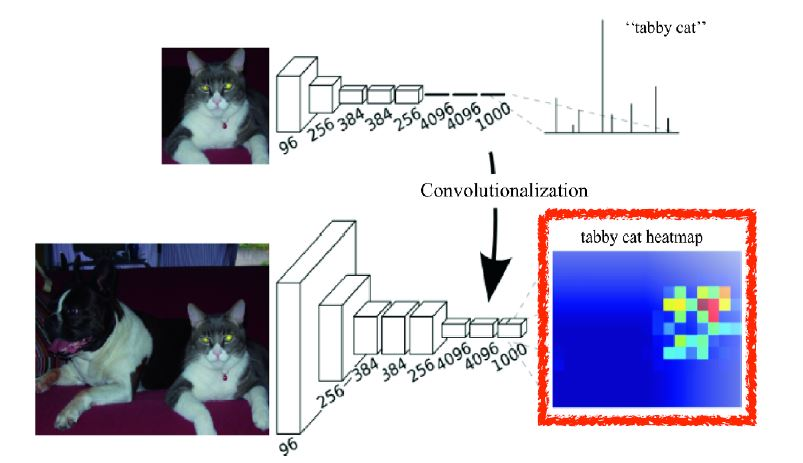
        * fully convolutional layer를 이용한 신경망 모델을 말합니다.
        * fully convolutional layer로 나온 high level feature map을 deconvolution layer를 통해 사이즈를 복원합니다.
        * fully convolutional layer
            * fully convolutional layer를 사용하여 fully connected layer와 달리 고정된 입력에서 자유로워 졌습니다.
            * 그래서 최종적인 결과는 앞에 이미지에서 추출된 high level feature의 heat map의 형태로 나오게 됩니다. 
        * devoncolution
            * 단순하게 말하면 convolution의 역연산으로 upsampling에서 잃어버린 정보를 복원하는 layer입니다.

# 과제
## 필수과제2 Convolutional Neural Network (CNN)
* 기본적인 CNN 모델로 mnist 데이터셋을 학습하는 코드에 빈칸을 채워넣는 과제였다.

```
# Convolutional layers
self.layers = []
prev_cdim = self.xdim[0]
for cdim in self.cdims: # for each hidden layer
    self.layers.append(
        nn.Conv2d(in_channels=prev_cdim,
                    out_channels=cdim,
                    kernel_size=self.ksize,
                    stride=(1,1),
                    padding=self.ksize//2)) # FILL IN HERE # convlution 
    if self.USE_BATCHNORM:
        self.layers.append(nn.BatchNorm2d(cdim)) # batch-norm
    self.layers.append(nn.ReLU(True))  # activation
    self.layers.append(nn.MaxPool2d(kernel_size=(2,2), stride=(2,2))) # max-pooling 
    self.layers.append(nn.Dropout2d(p=0.5))  # dropout
    prev_cdim = cdim

# Dense layers
self.layers.append(nn.Flatten())
prev_hdim = prev_cdim*(self.xdim[1]//(2**len(self.cdims)))*(self.xdim[2]//(2**len(self.cdims)))
for hdim in self.hdims:
    self.layers.append(nn.Linear(prev_hdim,hdim,bias=True)) # FILL IN HERE
    self.layers.append(nn.ReLU(True))  # activation
    prev_hdim = hdim
# Final layer (without activation)
self.layers.append(nn.Linear(prev_hdim,self.ydim,bias=True))
```
* ConvolutionalNeuralNetworkClass 클래스에서 Convolutional layer을 초기화 하는 부분으로 CNN의 입력채널 출력 채널 커널 사이즈 스트라이드, 패딩 등의 파라미터를 고려해야 했다.
* 다름은 Convolutional layer 다음에 위치할 dense layer 즉 fully connected layer를 정의해줬습니다.

```
for epoch in range(EPOCHS):
    loss_val_sum = 0
    for batch_in,batch_out in train_iter:
        # Forward path
        y_pred = C.forward(batch_in.view(-1,1,28,28).to(device))
        loss_out = loss(y_pred,batch_out.to(device))
        # Update
        # FILL IN HERE      # reset gradient 
        optm.zero_grad()
        # FILL IN HERE      # backpropagate
        loss_out.backward()
        # FILL IN HERE      # optimizer update
        optm.step()
        loss_val_sum += loss_out
    loss_val_avg = loss_val_sum/len(train_iter)
```
* 과제에서 반복적으로 나오는 optimizer 부분입니다. 아마 반복적으로 어떤 형식으로 구현되는지와 학습의 과정을 알려주기 위함인 것 같습니다.

# [피어세션](https://hackmd.io/@ai17/r1t-XxbeY)

# 후기
CNN에 대한 부분과 application들을 알아보았는데 예전에 공부했던 내용을 정리하는데 부족한 느낌이 들었습니다. 주말에 시간이 되면 내용을 좀더 보강하여 정리해야 겠다는 생각이 듭니다.